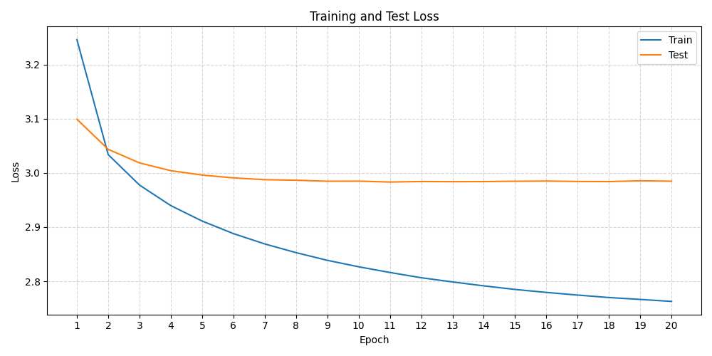
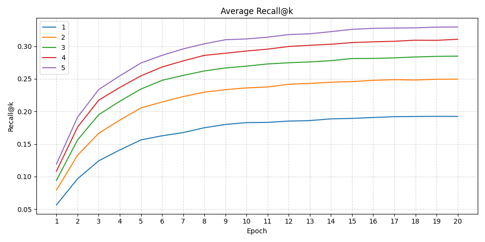

# word2vec
JetBrains internship application

## Data
Weights, training data, losses and scores can be found in [https://drive.google.com/drive/folders/1yFB9ciApYhACdVesXQeOKaS_EJY-t2n6?usp=drive_link](https://drive.google.com/drive/folders/1yFB9ciApYhACdVesXQeOKaS_EJY-t2n6?usp=sharing).
There are 2 zip files, small_data_collection contains 2 examples of in and out weights (of training epoch 1 and 11), the training dataset, the analogies dataset and the vocabulary. 

big_data_collection contains all in and out weights, as well as the training and test losses, the analogy (recall) scores, the training dataset, the analogies dataset and the vocabulary.

The downloaded zipfile should be unzipped, such that the file locations of the required files can be passed to the training and analyzing scripts.

## How to run
### Training
The training code can be run using `TrainModel.py`. It requires 3 arguments, the data for the input_file and analogies_file can soon be found in the Google Drive above
- `--input_file` Location to the training corpus
- `--analogies_file` Location to file with analogy pair combinations 
- `--output_directory` Location where the output of the model should be stored

There are also optional parameters that can be changed.

- `--epochs` Number of training epochs (default = 20)
- `--k` Number of negative samples per positive (default = 10)
- `--window` Context window size (default = 5)
- `--lr` Initial learning rate (default = 0.0005)
- `--dimension` Embedding dimension (default = 300)
- `--seed` Random seed (default = 42)
- `--recall_k` K for analogy recall@K (default = 5)

### Loading weights and testing analogies
To see that the model outputted valid vector representations, the weights can also be downloaded above and AnalyseData.py can be run. The weights provided are of dimension 300 and trained on part of the Google 1 billion words dataset. Eventually the average score of the analogies came to ~19%, using the same dataset as in the original Word2Vector paper. 

To test your own analogy combinations, you can run the code and will be prompted with giving 3 words and then the number of words to retrieve.
Given for instance word1 = "jump", word2 = "jumped", word3 = "fall", the model should aim to retrieve "fell".

The following are always required:

- `--vocab_location` location of the vocabulary file
- `--input_weights` location of the input weights file
- `--output_weights` location of the output weights file

Furthermore, to get plots of the training and test loss, the following arguments have to be passed
- `--training_loss` location of the training loss file
- `--test_loss` location of the test loss file

Resulting in:

Finally, to get a plot of the analogy scores, the following argument has to be passed
- `--analogy_scores` location of the analogy scores file

Resulting in:

